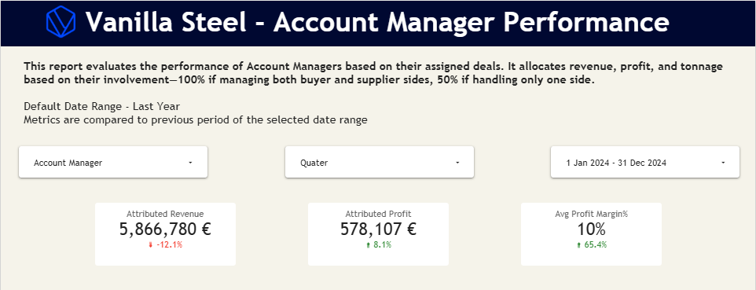
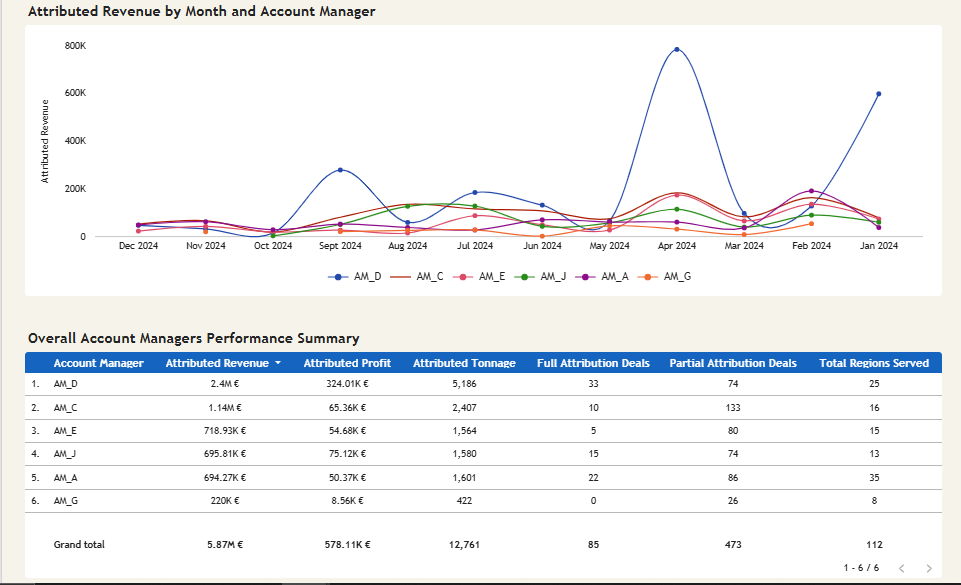
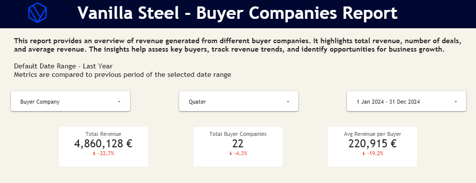
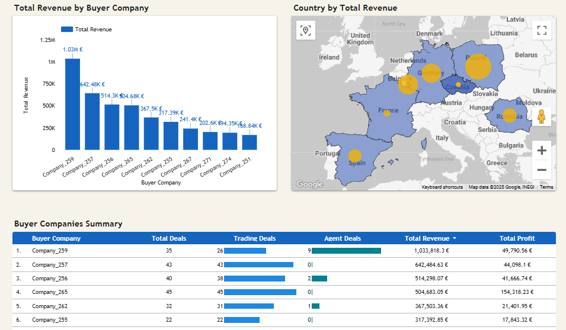

# **Task 2 Approach Description - Analysis & Insights**

Task 2 of the assessment focused on data analysis and visualisation. I had to work with `deal.csv` dataset which had multiple columns and required cleaning and prep before it could be used for visualisation. Therefore I chose to first create the datasets in BigQuery using SQL and then connect the output to Looker Studio.

Link to report: https://lookerstudio.google.com/reporting/85c4a40b-ee8c-4c25-8d51-6d5fdb3eef31/page/Rhp0E

## **Account Manager Performance Report**

The final dataset aggregated Account Manager (AM) performance metrics at a monthly and yearly level. 
It included the following components:
- AM ID & Account Manager Identifiers
- Month & Year for time period analysis

**Metrics**
- *Total Deals* - The count of unique deal IDs handled by each Account Manager.
- *Full Attribution Deals* - The count of deals with full attribution (attribution factor = 1.0).
- *Partial Attribution Deals* - The count of deals with partial attribution (attribution factor = 0.5).
- *Attributed Tonnage* - The total tonnage attributed to each Account Manager based on the deals.
- *Attributed Revenue & Profit* - Financial metrics showing revenue and profit attributed to each AM after applying the attribution factor.
- *Profit Margin %* - The ratio of attributed gross profit to attributed gross revenue, representing the profitability of deals.

**Additional Context**
- *Regions Served* - A list of distinct regions served by the Account Manager, aggregated as a comma-separated string.
- *Total Regions Served* - The count of unique regions covered by the Account Manager.
- *Buyer Side Deals & Supplier Side Deals* - The count of deals categorized by the AM's role as either "Buyer Side" or "Supplier Side."

### **Insights and Findings for CY 2024**
- *Revenue Distribution* - AM_D significantly outperforms others with €2.4M (40.9% of total revenue), followed by AM_C with €1.14M (19.4%)
- *Profit Leader* - AM_D generated €324K profit, over 56% of total profit
- *Efficiency* - AM_D has high profit margin (13.5%) while handling large volume (5,186 tons)
- *Deal Structure* - AM_C manages highest number of deals (143), but 93% are partial attribution deals
- *Market Coverage* - AM_A serves the most regions (35), indicating widest market presence
- *Profit Improvement* - Despite revenue decline, attributed profit up 8.1% and profit margin improved 65.4%

## **Buyer Companies Report Report**

The dataset aggregated key performance metrics for buyer companies based on their deals in order to provide insights on the volume, financial performance, and purchase behavior of buyers over time. 
It included the following components:
- *Buyer ID & Buyer Company*- Identifiers for the buyer company and its name.
- *Region & Country*- Geographic location of the buyer company.

- *Month*- The truncated date of the deal's creation (monthly).
- *Year*- The year in which the deal was created.
- *Quarter*- The quarter in which the deal was created.

- *Total Deals*- The total count of unique deals made by the buyer company.
- *Trading Deals*- The count of deals categorized as 'trading'.
- *Agent Deals*- The count of deals categorized as 'agent'.

- *Total Tonnage*- The sum of confirmed tonnage for all deals made by the buyer company.
- *Avg Deal Size Tons*- The average tonnage per deal, indicating the typical deal size.

- *Total Revenue*- The sum of confirmed gross revenue generated by the buyer company.
- *Total Profit*- The sum of confirmed gross profit from the buyer company's deals.

- *Profit Margin %*- The percentage of profit relative to revenue, calculated as `(Total Profit / Total Revenue) * 100`.

- *Unique Suppliers*- The count of distinct supplier companies that the buyer has engaged with.
- *Average Deal Value*- The average revenue per deal for the buyer company.

- *First Purchase Date*- The date of the first deal made by the buyer company.
- *Most Recent Purchase*- The date of the most recent deal made by the buyer company.
- *Active Months*- The count of distinct months during which the buyer company made deals, indicating how frequently they were active in terms of purchasing.

### **Insights and Findings for CY 2024**

- *Top Clients* - Company_259 (€1.03M) and Company_257 (€642K) account for 34.5% of total buyer revenue
- *Profitability* - Company_265 has exceptional profit of €154K (30.6% profit margin) despite ranking 4th in revenue
- *Deal Patterns* - Company_257 handled 43 deals (all trading deals), showing strong direct engagement
- *Company_259* - Unique mix of trading (26) and agent (9) deals, suggesting diverse transaction approaches
- *Declining Trend* - Overall buyer revenue down 22.7% compared to previous period
- *Market Contraction* - 4.3% reduction in total buyer companies

